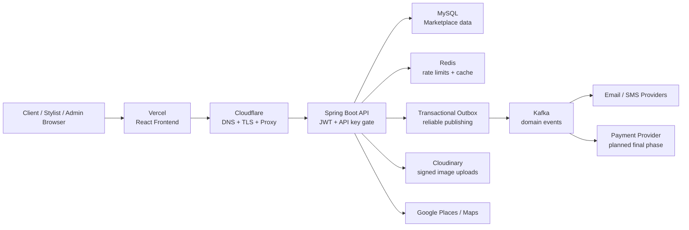

# RapidStylers Frontend


RapidStylers is a Canadian beauty-services marketplace that connects clients with vetted mobile beauty professionals for in-home and on-location appointments.

This repository is the React web app for the public site, customer dashboard, stylist onboarding and dashboard, and admin console. It is built to feel polished on the outside, but under the surface it now connects to a hardened Spring Boot backend with JWT role checks, Redis-backed rate limiting, Kafka/outbox-ready asynchronous workflows, Cloudinary signed uploads, Google Places, and distance-aware booking pricing.

## Product Preview


The product is designed around three audiences:

| Audience | What they can do |
| --- | --- |
| Clients | Discover stylists, view profiles, book appointments, manage saved stylists, cards, notifications, support, loyalty, and feedback. |
| Beauty professionals | Register as a stylist, verify email, add business details, upload images, manage services, availability, portfolio, appointments, and profile settings. |
| Admins | Moderate stylists and reviews, manage service categories, publish blog content, inspect platform KPIs, support tickets, and audit logs. |

## Why This Project Matters

RapidStylers is not a static landing page. It is a marketplace workflow with real operational concerns:

- Booking prices are backend-owned, including a vendor-set base earning for the first 15 km and additional travel calculation above 15 km.
- Login attempts are audited and rate-limited through Redis instead of local memory.
- Notifications are being moved behind Kafka/outbox so email, SMS, booking, and payment-side effects do not block core user flows.
- Cloudinary uploads are signed by the backend, folder-restricted, and rate-limited to reduce abuse.
- Role-protected APIs separate `CUSTOMER`, `STYLER`, and `ADMIN` actions.
- Vercel hosts the frontend, while the backend is intended to run on a VPS behind Cloudflare with Dockerized Redis, Kafka, database, and Spring Boot services.

## Recent MVP Changes

The current MVP pass focused on turning the prototype into a more production-shaped system:

| Area | Recent change |
| --- | --- |
| Booking economics | Added support for stylist/vendor base earning within 15 km and extra distance-based charges above 15 km. |
| Messaging architecture | Added Kafka/outbox direction so notification, email, SMS, booking, and payment events can be processed asynchronously. |
| Runtime infrastructure | Dockerized Redis and Kafka with ports chosen to avoid conflict with the AfroChow local stack. |
| Security | Added Redis-backed rate limiting, login attempt audit records, stricter CORS configuration, JWT role protection for sensitive endpoints, and guarded Cloudinary upload signatures. |
| UX polish | Fixed the stylist registration CTA so it navigates to `/styler-signup` and behaves like a real responsive button. |
| Deployment | Prepared Cloudflare/Vercel domain flow for `rapidstylers.ca` and `www.rapidstylers.ca`, with backend expected at `api.rapidstylers.ca`. |

## System Design



### Request Flow

1. The React app sends API requests through the centralized Axios client.
2. The client attaches the shared API key and, when available, the JWT from `sessionStorage`.
3. The backend API-key filter rejects unknown clients, while the JWT filter protects role-specific endpoints.
4. Core transactions write business data first, then queue side effects through the outbox.
5. Kafka consumers process background work such as notifications, email, SMS, and future payment events without rolling back the booking flow if a vendor is temporarily down.

## Frontend Architecture

```text
src/
|-- assets/                 brand images, logos, icons, video, fonts
|-- components/             reusable UI and domain components
|-- context/                Location and stylist signup context providers
|-- hooks/
|   |-- local/              Redux store, reducers, and local workflows
|   `-- remote/             Axios client, API service methods, API tests
|-- pages/
|   |-- admin/              admin login, categories, blog, stylists, operations
|   |-- generalPages/       landing, auth, search, blog, stylist profiles
|   |-- styler/             onboarding, dashboard, profile, appointments
|   `-- users/              customer dashboard, booking, account, support
|-- utils/                  constants, crypto helpers, Cloudinary upload helper
|-- App.js                  route table and lazy-loaded page entry points
|-- index.js                React bootstrap
`-- index.css               Tailwind layers and global UI styling
```

## Stack

- **React 18** with Create React App and React Router v6.
- **Redux Toolkit** for shared app state and async workflows.
- **Tailwind CSS** for layout and visual styling.
- **MUI 5** for selected controls and interface pieces.
- **Formik, Yup, and Zod** across legacy and newer form flows.
- **Axios** through a centralized API client that attaches API key and JWT headers.
- **React Toastify** for success and error feedback.
- **Cloudinary** for direct browser image uploads using backend-issued signatures.
- **Google Places / Maps** for address capture and distance-aware booking.
- **Jest + React Testing Library** for UI and API-contract coverage.

## Local Development

Prerequisites:

- Node.js 18+
- npm 9+
- RapidStylers backend running locally or reachable over HTTPS
- Matching frontend/backend API key values
- Google Maps key for address autocomplete and distance workflows

```bash
git clone git@github.com:Ibikunleogunbanwo/Rapidstylers_Frontend.git
cd Rapidstylers_Frontend
npm install
cp .env.example .env
npm start
```

The dev app runs on `http://localhost:3000`.

### Environment Variables

```bash
# Must match APP_API_KEY in Rapidstylers_Backend/.env
REACT_APP_API_KEY=your_api_key

# Include /rapid_stylers and no trailing slash
REACT_APP_API_BASE_URL=http://localhost:9090/rapid_stylers

# Must match the backend integration key if enabled
REACT_APP_DECRYPT_KEY=your_decrypt_key

# Browser key for Places autocomplete and distance workflows
REACT_APP_GOOGLE_MAPS_KEY=your_google_maps_key

# Leave empty until AdSense is approved
REACT_APP_ADSENSE_CLIENT=
```

`.env`, `.env.local`, `.freebuff/`, IDE metadata, and local agent folders should stay out of Git.

## Useful Scripts

| Command | Purpose |
| --- | --- |
| `npm start` | Start the local CRA dev server. |
| `npm test` | Run Jest in watch mode. |
| `CI=true npm test -- --watchAll=false` | Run the test suite once for verification. |
| `npm run build` | Create the production build in `build/`. |

## Deployment Shape

Production is intended to look like this:

```text
rapidstylers.ca       -> Vercel frontend
www.rapidstylers.ca   -> Vercel frontend
api.rapidstylers.ca   -> Spring Boot backend on VPS, proxied through Cloudflare
```

Set these values in Vercel:

```bash
REACT_APP_API_BASE_URL=https://api.rapidstylers.ca/rapid_stylers
REACT_APP_API_KEY=production_api_key
REACT_APP_DECRYPT_KEY=production_decrypt_key
REACT_APP_GOOGLE_MAPS_KEY=production_google_maps_key
REACT_APP_ADSENSE_CLIENT=
```

After changing Vercel environment variables, redeploy. Create React App bakes environment variables into the static bundle at build time.

## Backend Contract Notes

- API calls should go through `src/hooks/remote/apiService.js`.
- Backend responses may return HTTP 200 with an app-level `statusCode: "400"`, so pages must inspect the body before treating a request as successful.
- Auth tokens live in `sessionStorage` under `rapidstylers_auth_token`.
- Booking totals are displayed in the UI, but the backend is the source of truth.
- Landing/blog pages include fallback content so Vercel does not show a broken public site if the backend is not reachable.
- Cloudinary uploads use signed parameters from `/get_upload_signature`; the backend limits folder prefixes and request rate.

## Testing

Latest verification from the MVP hardening pass:

```text
Frontend tests: 23 passed
Frontend build: compiled successfully
Backend tests: 39 passed
```

Run before pushing frontend changes:

```bash
CI=true npm test -- --watchAll=false
npm run build
```

## Troubleshooting

| Symptom | First place to check |
| --- | --- |
| Vercel shows 4 fallback blog posts but localhost shows 3 real posts | Vercel API URL/API key may not be connected to the backend yet. Check the browser Network tab for `/list_blog`. |
| Login fails without a useful message | Confirm the page handles app-level `statusCode: "400"` responses, not only HTTP errors. |
| CORS error after deploying backend | Add the Vercel/Cloudflare origin to `CORS_ALLOWED_ORIGINS` on the backend. |
| Stylist signup upload fails | Confirm Cloudinary env values are set and the folder prefix is one of `profile`, `id`, `store`, or `portfolio`. |
| Booking price looks wrong | Check the stylist base distance/earning settings and the `travelDistanceKm` sent by the booking flow. |

## Recruiter Notes

RapidStylers demonstrates full-stack product thinking beyond screens:

- Marketplace domain modeling across clients, stylists, admins, bookings, reviews, support, loyalty, and notifications.
- Security hardening with JWT roles, rate limiting, login audit records, CORS controls, and safer upload signing.
- Event-driven design using Kafka and the transactional outbox pattern.
- Deployment awareness across Vercel, Cloudflare, Docker, Redis, Kafka, MySQL, and a VPS-hosted Spring Boot API.
- Practical UX work, including responsive public pages, onboarding flows, dashboards, fallback content, and user-facing error states.

## Contact

Ibikunle Ogunbanwo

`ibikunleogunbanwo@gmail.com`
